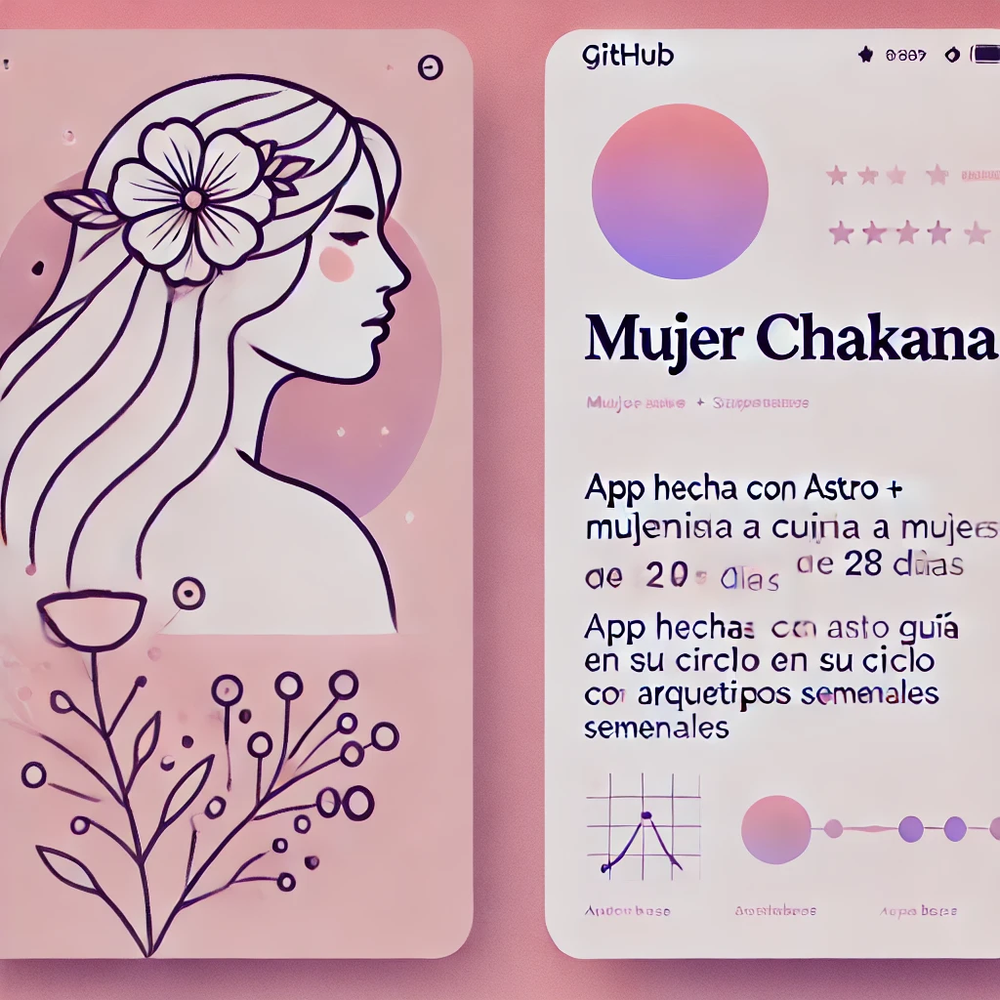

<p align="center">
  
</p>

# 🌺 Mujer Chakana

Bienvenida a **_Mujer Chakana_**, una aplicación desarrollada con Astro, TailwindCSS y Supabase que acompaña el ciclo femenino en un recorrido simbólico de **28 días**, guiado por arquetipos femeninos inspirados en la **Chakana** y la cosmovisión andina.

Un proyecto que une tecnología, espiritualidad y memoria ancestral para reconectar con los saberes del cuerpo y la tierra.

---

## ✨ Tecnologías utilizadas

- ⚡️ [Astro](https://astro.build/) — Framework moderno orientado a performance
- 🎨 [TailwindCSS](https://tailwindcss.com/) — Utilidades CSS para una UI elegante
- 🧠 [Supabase](https://supabase.com/) — Backend-as-a-Service (Auth + DB)
- 📨 Magic Link Authentication
- 📦 RLS (Row Level Security) en Supabase para proteger los datos

---

## 📁 Estructura del proyecto

```
.
├── src
│   ├── layouts
│   │   └── Layout.astro         # Layout base estilizado
│   ├── pages
│   │   ├── index.astro          # Página de bienvenida
│   │   ├── setup.astro          # Formulario para configurar fecha de inicio
│   │   ├── dashboard.astro      # Calcula y muestra el arquetipo actual
│   │   └── login.astro          # Login con magic link
│   ├── lib
│   │   └── supabaseClient.ts    # Cliente de Supabase
│   └── styles
│       └── global.css           # Estilos globales
```

---

## 🔐 Supabase Auth + RLS

Se utiliza autenticación mediante **enlace mágico** (Magic Link).

### 🧱 Tabla `arquetipo`

| Columna       | Tipo     | Descripción           |
| ------------- | -------- | --------------------- |
| `dia_lunes`   | `number` | Día del ciclo (1–28)  |
| `nombre`      | `text`   | Nombre del arquetipo  |
| `descripcion` | `text`   | Descripción simbólica |

### 🧱 Tabla `perfiles`

| Columna        | Tipo   | Descripción                  |
| -------------- | ------ | ---------------------------- |
| `id`           | `uuid` | ID del usuario (auth.uid)    |
| `fecha_inicio` | `date` | Fecha elegida por la usuaria |

### ✅ Políticas RLS implementadas

```sql
-- SELECT
auth.uid() = id

-- INSERT
auth.uid() = id
WITH CHECK (auth.uid() = id)

-- UPDATE
auth.uid() = id
WITH CHECK (auth.uid() = id)
```

---

## 🧠 Cálculo del día del ciclo

Se calcula automáticamente al iniciar sesión en base a la fecha guardada:

```ts
function calcularDiaCiclo(fechaInicio: Date): number {
  const hoy = new Date();
  const diffTime = hoy.getTime() - fechaInicio.getTime();
  const diffDays = Math.floor(diffTime / (1000 * 60 * 60 * 24));
  return (diffDays % 28) + 1;
}
```

---

## ✨ UI/UX moderno

- Tipografía `Outfit` desde Google Fonts
- Layout responsivo con Tailwind
- Botones redondeados, colores suaves y accesibilidad
- Scroll suave (`scroll-behavior: smooth`)

### Página principal (`index.astro`)

- Texto introductorio con sentido simbólico
- Botones: _Configurar ciclo_ y _Ir al dashboard_

### Página de setup

- Selector de fecha (`<input type="date">`)
- Guarda automáticamente la fecha en Supabase
- Redirecciona a `/dashboard`

---

## 🗖️ Arquetipos Chakana

Los arquetipos se alinean con los **28 días del ciclo lunar/femenino**, acompañando con energía, guía y simbolismo.

| Día del ciclo | Arquetipo     | Energía guía                                 |
| ------------- | ------------- | -------------------------------------------- |
| 1             | La Visionaria | Intuición, claridad y dirección interna      |
| 8             | La Curandera  | Sanación, sabiduría ancestral, medicina viva |
| 15            | La Guerrera   | Fuerza, valentía, protección del territorio  |
| 22            | La Madre      | Nutrición, cuidado, visión amorosa           |

(Puedes ampliar la tabla con los 28 registros)

---

## 🧪 Próximos pasos

- [ ] Añadir ilustraciones por arquetipo
- [ ] Calendario visual de progreso
- [ ] Guardar notas personales por día
- [ ] Compartir arquetipos en redes sociales
- [ ] Incorporar audio-meditaciones por arquetipo

---

## 🧘‍♀️ Contribuye

Este proyecto está en evolución. Si quieres sumar tus ideas, arte, visión espiritual o mejoras en código, ¡eres muy bienvenida! 🌈

---

## 💖 Créditos

Creado con ❤️ para acompañar a mujeres y cuerpas cíclicas en su conexión profunda con la sabiduría ancestral.

---

> “La Chakana nos recuerda que somos puente entre mundos, y que el camino espiritual comienza en nosotras.” — Mujer Chakana
